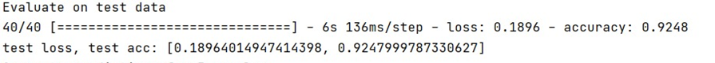
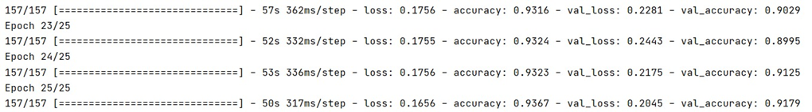

# Male-Female Audio Classification Deep Learning Project
 
## Model Type
RNN with LSTM layer model

## Data
Audio files were taken from [openslr](http://www.openslr.org/12/) .  
Using audio files and extracting the features ourself allowed the creation of RNN which relies on the data being a sequence.   
Mfcc features were extracted from the audio files and were separated to train, valuation and test.  
The data set is a data set made for speech recognition (of words), but since it has classification for the speakers for female or male, it could be used in this project.  

## Installation & Usage

- Extracting audio features from audio files:   
   Download 'train-clean-100', 'train-clean-360', 'dev-clean', 'test-clean' folders
   from [openslr](http://www.openslr.org/12/)  
      ```clone https://github.com/mor234/male_female_audio_classification_deep_learning.git```
   extract the folders and place them in the data folder.  
      ```python keep_features_in_file.py```-take audio features and save them into csv files. 

You can also use the csv files already created, and start from here.
- Creating, training and using the model:  
   ```python train_model.py``` -train the model.   
   ```python evalute_on_test.py``` -view the trained model results.

## Solution description:
The model is implemented using RNN with LSTM layer.
20,000 voice recording were used. 
Mfcc features were extracted from all the audio files (128 from each), 
and the features were normalized.
Libraries used: numpy and kerse from tensorflow for the implementation of the network, 
and torch and skleran to process the data and for normalization.

The model has the following layers:
1. LSTM layer-for "remembering" the data, layer that contains cyclic connections, with 256 neurons.
2. second layer- another layer with 128 neurons and relu activation.
3. The final layer -classifies by using soft max for 2 classes.   
The optimizer is Adam optimizer (which is efficient and keep learning rate per parameter, and changes the learning rate based on the average of recent magnitude of the gradients for weight) . 
The model was compiled with 'sparse_categorical_crossentropy' – for categorical classification with integer labels. 
The network in code:
### Model:
```
input_shape = (128, 1)
model = keras.Sequential()
model.add(LSTM(256, input_shape=input_shape))
model.add(Dense(128, activation='relu'))
model.add(Dense(2, activation='softmax'))

model.summary()

# change default learning rate
opt = keras.optimizers.Adam(learning_rate=0.001)

# load kept model. this is final model
model.compile(optimizer=opt, loss='sparse_categorical_crossentropy', metrics=['accuracy'])
history = model.fit(X_train, y_train, epochs=50
                    , batch_size=72,
                    validation_data=(X_val, y_val), shuffle=False)            
 ```

## Results:
Achieved results of 93% on training set, 91% on valuation set and 92% on testing set.

